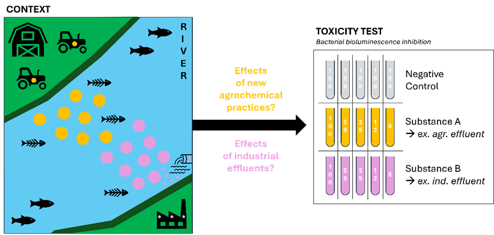
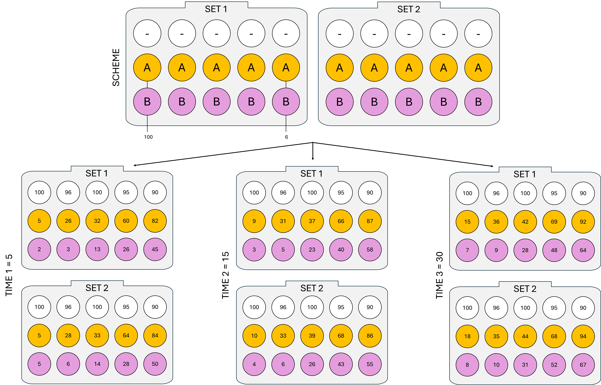
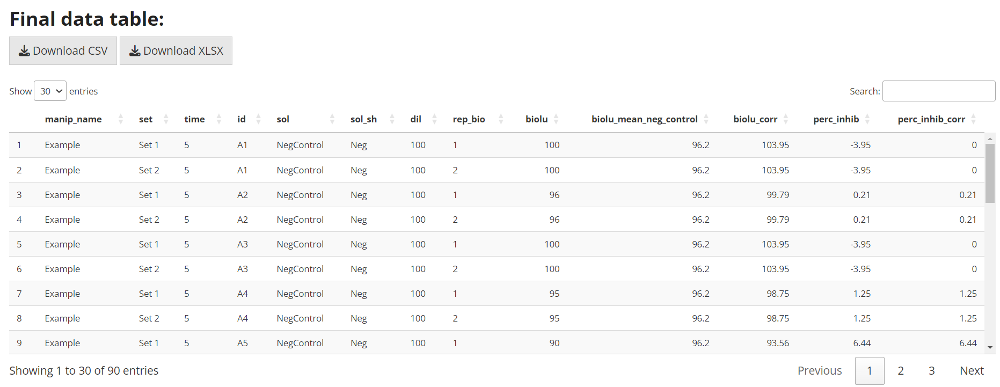
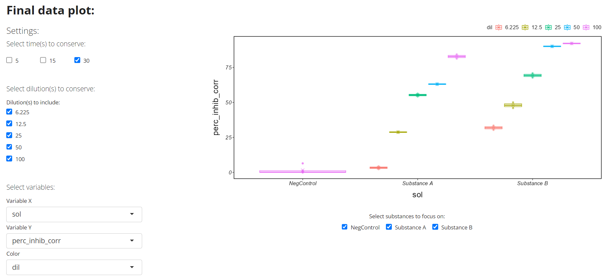
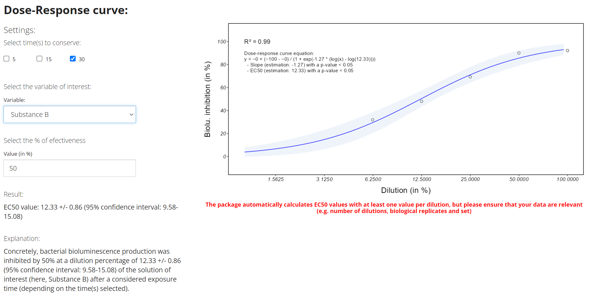

### Context of the example study

In a geographical area, **new agricultural and industrial practices** were introduced **close to a river** (Fig. 1). **Ecological disasters** followed rapidly afterwards, with fish species seeing their populations collapse.

Thus, local authorities have called on the scientific community to study and understand this phenomenon. To **understand** the **toxic effect** of new molecules used in agriculture and industry close to the river, scientists proposed the **use of a bioassay: the toxicity test based on bacterial bioluminescence inhibition**; using samples of the new agrochemicals and industrial effluent at various relevant concentrations (Fig. 1).

### Enter the data in the application

Once the experiment has been set up and run, the bacterial bioluminescence values are retrieved. The data must then be entered into the application (Scheme, Time 1, Time 2 and Time 3 tabs) as presented in Figure 2.

{width="547"}

### Final data table

A cleaned final table can be exported with the test results (Fig. 3). In general, the most useful quantitative variable is *perc_inhib_corr*, which expresses the percentage of inhibition of bacterial bioluminescence by correcting the bioluminescence values obtained and entered in the application with the bioluminescence values of the negative control to obtain a maximum threshold value of 100%. The data can be exported in *.csv* or *.xlsx* formats.

### Final data plot

In our context, an easily modifiable plot can be obtained to analyse the global situation of this locality (Fig. 4). The graph showed that even at low dilution, the percentage inhibition of bioluminescence indicates high toxicity for both effluents, at time 30.

### Dose-response curve

In our context, the scientists then focused on substance B (i.e. industrial effluent) at time 30, which appears to be more toxic, to obtain its EC~50~ value from its dose-response curve. An EC~50~ of 12.33% (with a standard deviation of 0.86 and a 95% confidence interval of 9.58-15.08) can be obtained, here for the industrial effluent (Fig. 5). In other words, the concentration required to obtain a 50% response in exposed organisms compared with the negative control was 12.33% (Fig. 9). Furthermore, the value of the R² (0.99) and the significance of the EC~50~ parameter (\< 0.05) can be verified to ensure the robustness of the EC~X~ value obtained.

### Conclusion

Using the application, we were able to quickly and easily visualise the results of this study:

-   both effluents were toxic at first view

-   the industrial effluent appeared more toxic than the agricultural effluent

-   the ec50 of the industrial effluent was 12.33% (p-value \< 0.05)
