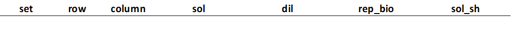
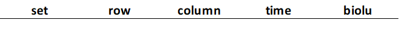
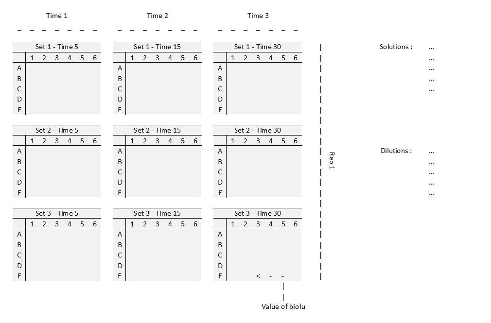

### Download

```{r package, echo = FALSE, warning = FALSE, error = FALSE, message = FALSE}

# install.packages("remotes")
# remotes::install_github("fmmattioni/downloadthis")
library(downloadthis)
```

```{r button ex, echo = FALSE}

download_file(
  path = "links/ex.xlsx",
  output_name = "Download an example (.xlsx file)",
  button_label = "Download an example (.xlsx file)",
  button_type = "default",
  has_icon = TRUE,
  icon = "fa fa-save",
  self_contained = FALSE
)
```

```{r button blank, echo = FALSE}

download_file(
  path = "links/blank.xlsx",
  output_name = "Download a blank format (.xlsx file)",
  button_label = "Download a blank format (.xlsx file)",
  button_type = "default",
  has_icon = TRUE,
  icon = "fa fa-save",
  self_contained = FALSE
)
```

### Structure of .xlsx file

Five tabs:

-   scheme: to prepare the details of your exposure conditions.

    {width="408"}

-   time 1: to enter the value of your bioluminescence measurement at time 1.

    {width="271"}

-   time 2: to enter the value of your bioluminescence measurement at time 2.

    {width="271"}

-   time 3: to enter the value of your bioluminescence measurement at time 3.

    {width="271"}

-   structure: to visualize the matrix of your experiment.

    {width="427"}
